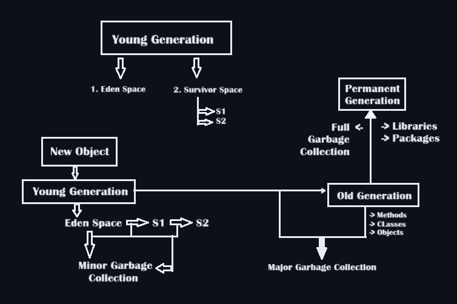
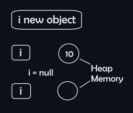

### Index:  

* [12. Object Oriented Programming](#12-object-oriented-programming)   
   + [1. Encapsulation](#encapsulation)  
   + [2. Inheritance](#inheritance)  
   + [3. Abstraction](#abstraction)  
   + [4. Polymorphism](#polymorphism)  
   + [5. Interface](#interface)  
   + [6. Coupling & Cohesion](#coupling-and-cohesion)  
* [13. Generics](#13-generics)  
   + [1. Generic Class](#generic-class)  
   + [2. Generic Method](#generic-method)  
   + [3. Overriding toString](#tostring-overriding)  
   + [4. Overriding equals](#equals-overriding)  
   + [5. Map Interface](#map-interface)  
   + [6. Set Interface](#set-interface)
   + [7. List Interface](#list-interface)  
   + [8. Queue Interface](#queue-interface-fifo)  
   + [9. Stream API](#stream-api)
* [14. Error Handling](#14-error-handling)  
  + [1. Logical Error](#1-logical-error)  
  + [2. Syntactical Error](#2-syntactical-error)  
  + [3. Semantic Error](#3-semantic-error)  
  + [4. Exception Handling](#exception-handling)  
* [15. Garbage Collection](#15-garbage-collection)  
* [16. String, IO &amp; File Handling](#16-strings-io-operations-and-file-management)  
  + [1. IO Operations](#io-operations)  
  + [2. String Stuff](#string-stuff)  
  + [3. File Handling](#file-handling)  
* [17. Data Structure](#17-strings-io-operations-and-file-management)  
<hr> 

# 12. Object Oriented Programming   

## Encapsulation:

* Hiding "sensitive" information/data from outside access.
* It's a process of wrapping information/data into a single piece.
* Two Rules :
  1. Declare class attributes/variables as private.
  2. Use GET & SET methods to access &  update the private attributes/variables.
* Example: [TestEncapsulation.java](https://github.com/subhajyoti-prusty/College_Assignments/blob/f3929e63c89fcb67f0ddb3de364f9c2e928e841a/SEM_4/CSW/Class%20Lecture/12%20Object%20Oriented%20Programming/1_Encapsulation/TestEncapsulation.java)
```ruby
class Person
{
	private int Age;
	private String Name;
	
	// We will employ get and set methods to use the class objects
	public String getName()
	{
		return Name;
	}
	
	public int getAge()
	{
		return Age;
	}
	
	public void setAge(int Age)
	{
		this.Age = Age;
	}
	
	public void setName(String Name)
	{
		this.Name = Name;
	}
}

public class TestEncapsulation
{
	public static void main(String args[])
	{
		Person obj = new Person();
		obj.setName("Mark");
		obj.setAge(30);
		System.out.println("Name is: " + obj.getName());
		System.out.println("Age is: " + obj.getAge());
	}
}
```
* | Advantages                                                                                                | Disadvantages                                      |
  | --------------------------------------------------------------------------------------------------------- | -------------------------------------------------- |
  | Code becomes more flexible. The programmer can change one part of the code without affecting other parts. | It can lead to complex code, if not used properly. |
  | Attributes can be made read-only or write-only according to the programmer's choice.                      | May limit the flexibility of implementation.       |
  | Increases security of data.                                                                               | It makes the code more difficult to understand.    |

  ## Inheritance:

* It's a mechanism in which one object acquires all parent object's properties and behaviors (attributes and methods).
* You can build a new class upon an existing class which will pose all the properties of the parent class.
* Syntax: class SubClassName extends SuperClassName{
              //methods
          }
* Example: [Inheritance.java](https://github.com/subhajyoti-prusty/College_Assignments/tree/f3929e63c89fcb67f0ddb3de364f9c2e928e841a/SEM_4/CSW/Class%20Lecture/12%20Object%20Oriented%20Programming/2_Inheritance)
* 3 Types:
  1. Single Inheritance [class A] <-- [class B]
```ruby
     class Employee
{
	int Salary = 40000;
    void eat(){
        System.out.println("Employee is eating");
    }
}
class programmer extends Employee
{
	int Bonus = 10000;
    void bark(){
        System.out.println( "Programmer is Barking" );
    }
	public static void main(String[] args)
	{
		programmer obj = new programmer();
		System.out.println(obj.Salary);
		System.out.println(obj.Bonus);
        obj.eat();
        obj.bark();
	}
}
```
  2. Multilevel Inheritance [class A] <-- [class B] <-- [class C]
```ruby
class Employee
{
	int Salary = 40000;
    void eat(){
        System.out.println("Employee is eating");
    }
}
class programmer extends Employee
{
    int Bonus = 10000;
    void bark(){
        System.out.println( "Programmer is Barking" );
    } 
}
class puppy extends programmer
{
	int Fees = 1000000;
    void cry(){
        System.out.println( "Programmer is Crying" );
    }
	public static void main(String[] args)
	{
		puppy obj = new puppy();
		System.out.println(obj.Salary);
		System.out.println(obj.Bonus);
        obj.eat();
        obj.bark();
        obj.cry();
	}
}
```
  4. Heirarchial Inheritance [class C] --> [class A] <-- [class B]
```ruby
class Animal
{
    void eat()
    {
        System.out.println("eating...");
    }
}

class Dog extends Animal
{
    void bark()
    {
        System.out.println("barking...");
    }
}

class Cat extends Animal
{
    void meow()
    {
        System.out.println("meowing...");
    }
}

class TestInheritance3
{
    public static void main(String args[])
    {
        Cat c = new Cat();
        Dog d = new Dog();
        c.meow();
        c.eat();
        d.bark();
        d.eat();
    }
}
```
* | Advantages                                                                              | Disadvantages                                                                             |
  | --------------------------------------------------------------------------------------- | ----------------------------------------------------------------------------------------- |
  | It makes the code reusable as the superclass remains the same for all subclasss.        | Inheritance makes it difficult to make changes to superclass without affecting the subclass. |
  | Helps to implement, extend, and maintain abstraction & runtime polymorphism.            | Multiple inheritance, etc make a code very complicated                                    |
  | It creates a class hierarchy which is more useful when dealing with real-world objects. |                                                                                           |

## Abstraction:

* It's the process in which we only show essential details/functionality to the user.
* The non-essential things are hidden from the user.
* Two ways to achieve Abstraction:
  1. Abstract class -> (o - 100%)
  2. Interface -> (100%)
* An abstract class must be declared with an abstract keyword:
  > abstract class A{ //code }
  >
* Example: [Abstraction.java](https://github.com/subhajyoti-prusty/College_Assignments/blob/f3929e63c89fcb67f0ddb3de364f9c2e928e841a/SEM_4/CSW/Class%20Lecture/12%20Object%20Oriented%20Programming/3_Abstraction/Abstraction.java)
   ```ruby
   abstract class Bike
   {
       abstract void run();
   }
   
   class Yamaha extends Bike
   {
       void run()
       {
           System.out.println("running safely");
       }
   }
   
   public class Abstraction
   {
   	public static void main(String args[])
       {
           Bike b = new Yamaha();
           b.run();
       }
   }
   ```
* Example: [TestAbstraction1.java](https://github.com/subhajyoti-prusty/College_Assignments/blob/f3929e63c89fcb67f0ddb3de364f9c2e928e841a/SEM_4/CSW/Class%20Lecture/12%20Object%20Oriented%20Programming/3_Abstraction/TestAbstraction1.java)
  ```ruby
     abstract class Shape {
      abstract void draw();
  }
  
  class Rectangle extends Shape {
      void draw() {
          System.out.println("drawing rectangle");
      }
  }
  
  class Circle1 extends Shape {
      void draw() {
          System.out.println("drawing circle");
      }
  }
  
  class TestAbstraction1 {
      public static void main(String args[]) {
          Shape s = new Circle1();
          s.draw();
      }
  }
  ```
* | Advantages                                                          | Disadvantages                                                                              |
  | ------------------------------------------------------------------- | ------------------------------------------------------------------------------------------ |
  | It protects the implementation of the program from users.           | Overuse of abstraction makes the code less optimal because of unnecessary layers of code. |
  | It provides flexibility as we can change the way we implement code. | It may limit the flexibility of implementation.                                            |
  | It makes code easier for debugging.                                 | It makes the code more difficult to understand.                                            |
  
## Polymorphism:

* Poly -> Many ; Morph -> Forms (from Greek)
* Like: Woman -> Mother -> Sister -> Wife -> Daughter
* To perform a single action in different ways
* The ability of a message to be displayed in more than one form
* Two Types:
  1. Compile Time/Static Polymorphism
     + Function Overloading
     + Operator Overloading [Not supported by Java]
     + Example: [TestOverloading1.java](https://github.com/subhajyoti-prusty/College_Assignments/blob/c719edf33d844db53eca299c24f765ae96d0d805/SEM_4/CSW/Class%20Lecture/12%20Object%20Oriented%20Programming/4_Polymorphism/TestOverloading1.java)
      ```ruby
      class Multiplier {
          static int mul(int a, int b) {
              return a * b;
          }
      
          static int mul(int a, int b, int c) {
              return a * b * c;
          }
      
          static double mul(double a, double b) {
              return a * b;
          }
      }
      
      class TestOverloading1 {
          public static void main(String[] args) {
              System.out.println(Multiplier.mul(11, 11));
              System.out.println(Multiplier.mul(11, 11, 11));
              System.out.println(Multiplier.mul(11.1, 11.1));
          }
      }
      ```
  2. Run Time Polymorphism
     + Dynamic Method Dispatch
     + Override the function at runtime
     + Override is when the derived class has same definition of the functions of box class.
     + Example: [TestOverriding1.java](https://github.com/subhajyoti-prusty/College_Assignments/blob/c719edf33d844db53eca299c24f765ae96d0d805/SEM_4/CSW/Class%20Lecture/12%20Object%20Oriented%20Programming/4_Polymorphism/TestOverriding1.java)
      ```ruby
      class Bike
      {
          void run()
          {
              System.out.println("Running at 400 kmph");
          }
      }
      
      class Honda extends Bike
      {
          void run()
          {
              System.out.println("More like 120kmph LOL");
          }
      }
      public class TestOverriding1
      {
          public static void main(String[] args)
          {
              Bike b = new Honda();
              b.run();
          }
      }
      ```
* In Overloading -> functions are in same class
* In Overriding -> functions are in different class
* | Advantages                                                                             | Disadvantages                                                            |
  | -------------------------------------------------------------------------------------- | ------------------------------------------------------------------------ |
  | It enables the correct method to be called at runtime based on actual class of object. | It makes it more difficult to understand the behaviour of an object.     |
  | It supports different constructions which gives flexibility to code.                   | Requires more computation at runtime, so it leads to performance issues. |
  | It makes writing a code easier using generic data type                                 |                                                                          |

## Interface:

+ Blue print of a class
+ It has static constants and abstract methods.
+ Interface can't be used to create objects.
+ "Implement" - used to achieve interface.
+ By default all attributes of interface are public, static & final.
+ One implementation - you must override all its methods.  

  ```ruby
  interface A{  
  static int a = 10; //declare constant fields.
  void move(); //declare abstract methods
  }
  ```

+ A class only extend to one class but can implement infinite interfaces.
+ Example: [testInterface1.java](https://github.com/subhajyoti-prusty/College_Assignments/blob/c719edf33d844db53eca299c24f765ae96d0d805/SEM_4/CSW/Class%20Lecture/12%20Object%20Oriented%20Programming/5_Interface/testInterface1.java)
   ```ruby
   interface MyInterface1 {
       public void method1();
   }
   
   interface MyInterface2{
       public void method2();
   }
   
   class DemoClass implements MyInterface1, MyInterface2{
       public void method1(){
           System.out.println("Method 1");
       }
       public void method2(){
           System.out.println("Method 2");
       }
   }
   
   public class testInterface1 {
       public static void main(String[] args) {
           DemoClass dc = new DemoClass();
           dc.method1(); // Call
           dc.method2(); // Call
       }
   }
   ```
+ [class] -- extends --> [class]
+ [class] -- implements --> [interface]
+ [Interface] -- extends --> [interface]
+ | Class                                                 | Interface                                                   |
  | ----------------------------------------------------- | ----------------------------------------------------------- |
  | Instantiate an object                                 | You can't instantiate an object                             |
  | class can have any method ( declaration & body )      | It can only have abstract method(only declaration, no body) |
  | The access specifiers are: Public Private & protected | Only Public                                                 |

## Coupling and Cohesion:

* It is used to solve complex problems.
* To deliver quality codes.
* Loose coupling and high cohesion are desirable for good practice of coding.
* **Coupling[interclass]:** 
  + Pairing, Interdependency
  + The extent to which a class knows about another class
  + Two Types:
    1. Loose Coupling
       + when class A doesn't have public variables
       + class A can't be accessed by any other class.
       + Example: [testLooseCoupling1.java](https://github.com/subhajyoti-prusty/College_Assignments/blob/c719edf33d844db53eca299c24f765ae96d0d805/SEM_4/CSW/Class%20Lecture/12%20Object%20Oriented%20Programming/6_Coupling%20%26%20Cohesion/testLooseCoupling1.java)
         ```ruby
         class A
         {
             private String name; //public data member of A class
         
             public String getName()
             {
                 if(name!=null) //checking a valid access of intance variable, "name"
                     return name;
                 else
                     return "not initialized";
             }
         
             public void setName(String s)
             {
                 if(s==null) //checking a valid setting of instance variable, "name"
                     System.out.println("cant initialize to a null dude");
                 else
                     name = s;
             }
         }
         
         class testLooseCoupling1
         {
             public static void main(String[] args) {
                 A a = new A();
                 a.setName(null);
                 System.out.println("Name is " + a.getName());
             }
         }
         /*output:
         cant initialize to a null dude
         Name is not initialized
          */
         ```
    2. Tight Coupling
       + when a class knows everything about another class.
       + If all the members are public, class B can access directly from class A using operators.
       + [class A] --Tight Coupling--> [class B]
       + Example: [testTightCoupling1.java](https://github.com/subhajyoti-prusty/College_Assignments/blob/c719edf33d844db53eca299c24f765ae96d0d805/SEM_4/CSW/Class%20Lecture/12%20Object%20Oriented%20Programming/6_Coupling%20%26%20Cohesion/testTightCoupling1.java)
         ```ruby
         class A
         {
             public String name; //public data member of A class
         
             public String getName()
             {
                 if(name!=null) //checking a valid access of intance variable, "name"
                     return name;
                 else
                     return "not initialized";
             }
         
             public void setName(String s)
             {
                 if(s==null) //checking a valid setting of instance variable, "name"
                     System.out.println("cant initialize to a null dude");
                 else
                     name = s;
             }
         }
         
         class testTightCoupling1
         {
             public static void main(String[] args) {
                 A a = new A();
                 a.name = null;
                 System.out.println("Name is " + a.name);
             }
         }
         /*
         Name is null
          */
         ```
* **Cohesion[intraclass]:**
  + It refers to the extent which a class is defined to do a specific specialized task.
  + Two Types:
    1. High Cohesion [Bad Programming Style]
       * when a class is designed to do a specific specialized task.
       * Example:
         ```ruby
         class player_data{
           class coonect_toplayer{connect_toplayer ctp = new connect_toplayer};
           class details_player{...};
           class player_rankiing{...};
           class game_details{...};
           class player_travel{...};
         }
         ```
    2. Low Cohesion [Good Programming Style]
       * when a class is designed to many tasks rather than a single task, it's calles a "low cohesive" class.
       * Example:
         ```ruby
         class player_data{
           public void connect_toplayer();
           public void details_player();
           public void player_rankiing();
           public void game_details();
           public void player_travel();
         }

	 ```
# 13. Generics:

* The java generics programming is introduced to deal with type-safe objects.
* It makes the code stable by detecting the bugs at compile time.
* Before generics you can store any type of objects in the collection i.e. non-generics.
  > [testNonGenerics1.java](https://github.com/subhajyoti-prusty/College_Assignments/blob/14ca388da5c9204b8ca4c20f2cf786e4dc16adf0/SEM_4/CSW/Class%20Lecture/13_Generics/testNonGenerics1.java)
```ruby
import java.util.ArrayList;
import java.util.List;
public class testNonGenerics1 {
    public static void main(String[] args) {
        List list = new ArrayList();
        list.add(10); //int
        list.add("20"); //string
        for(int i=0; i<list.size(); i++){
            System.out.println(list.get(i));  // loop printing
        }
        System.out.println(list.toString()); //direct printing
    }
}
```
* Now generics force the java programmer to store a specific type of objects.
* **Advantage of Generics:**
  1. Type-Safety :

     * You can hold a single type of objects in generics. It doesn't allow to store other objects.

     > [testGenerics1.java](https://github.com/subhajyoti-prusty/College_Assignments/blob/14ca388da5c9204b8ca4c20f2cf786e4dc16adf0/SEM_4/CSW/Class%20Lecture/13_Generics/testGenerics1.java)
```ruby
import java.util.ArrayList;
import java.util.List;

public class testGenerics1 {
    public static void main(String[] args) {
        List<Integer> list = new ArrayList<Integer>();
        list.add(10); //int
        // list.add("20"); "The method add(Integer) in the type List<Integer> is not applicable for the arguments (String)"
        for(int i=0; i<list.size(); i++){
            System.out.println(list.get(i));  // loop printing
        }
        System.out.println(list.toString()); //direct printing
    }
}
```
  2. No Type Casting Required :

     * Before generics, we needed to typecast.
       + [Non Generic](https://github.com/subhajyoti-prusty/College_Assignments/blob/14ca388da5c9204b8ca4c20f2cf786e4dc16adf0/SEM_4/CSW/Class%20Lecture/13_Generics/testNonGeneric2.java)
         ```ruby
         //Non generic typecasting
         
         import java.util.ArrayList;
         import java.util.List;
         
         public class testNonGeneric2 {
             public static void main(String[] args) {
                 List list = new ArrayList();
                 list.add("hello");
                 String s = (String)list.get(0); //(string) typecasting needed
                 System.out.println(s);
             }
         }
         ```
       + [Generic](https://github.com/subhajyoti-prusty/College_Assignments/blob/14ca388da5c9204b8ca4c20f2cf786e4dc16adf0/SEM_4/CSW/Class%20Lecture/13_Generics/testGenerics2.java)
         ```ruby
         //generic typecasting
         
         import java.util.ArrayList;
         import java.util.List;
         
         public class testGenerics2 {
             public static void main(String[] args) {
                 List<String> list = new ArrayList<String>();
                 list.add("hello");
                 String s = list.get(0); //no typecasting needed
                 System.out.println(s);
             }
         }
         ```
  3. It detects the bug in compile time.
     ```ruby
     List<String> list = newArrayList<String>();
     list.add("hello");
     list.add(32); //compiletime Error
     '''

## Generic class 
* A class that can refer to any type is a generic class. 
* You have to pass different parameters during the declaration of class.
* Types of parameters:
   1. T-Type  
   2. E-Elements  
   3. K-Key  
   4. N-Number
   5. V-Values
```ruby
class MyGen<T>{
    T obj;
    void add(T obj){
      this.obj=obj;
    }
    T get(){
      return obj;
    }
  }
``` 

## Generic Method  
```ruby
public class Test_Generic_Method{
    public static <T> void printArray(E[] elements){
      for(E element:elements){
        System.out.println(element;)
      }
    }
    public static void main(String[] args){
      Integer[] intArray = {10, 20, 30, 40, 50, 60};
      Character[] charArray = {'A', 'B', 'C', 'D', 'E'};
      printArray(intArray);
      printArray(charArray);
    }
  }
```

```ruby
class Test<T, U>{
    T obj1;
    U obj2;
    Test(T obj1, U obj2){
      this.obj1=obj1;
      this.obj2=obj2;
    }
    public static void print(){
      System.out.println(obj1);
      System.out.println(obj2);
    }
  }
  class Test_Generic{
    public static void main(String[] args){
      Test<String, Integer> obj = new Test<String, Integer>("Hello", 17);
      obj.print();
    }
  }
```

## toString Overriding  

**The Problem: [kichhigote1.java](https://github.com/subhajyoti-prusty/College_Assignments/blob/14ca388da5c9204b8ca4c20f2cf786e4dc16adf0/SEM_4/CSW/Class%20Lecture/13_Generics/1_toString%20Overriding/kichhigote.java)**  
```ruby
class complex
{
    private double re, in;
    public complex (double re, double in)
    {
        this.re = re;
        this.in = in;
    }
}

public class kichhigote
{
    public static void main(String[] args)
    {
        complex c1 = new complex(10.7, 15.9);
        System.out.println(c1);
    }
}

/*output:
complex@7ad041f3
*/
``` 

**The Solution: [ToString.java](https://github.com/subhajyoti-prusty/College_Assignments/blob/14ca388da5c9204b8ca4c20f2cf786e4dc16adf0/SEM_4/CSW/Class%20Lecture/13_Generics/1_toString%20Overriding/ToString.java)**  

```ruby
public class ToString
{
    public static void main(String[] args)
    {
        Complex c1 = new Complex(10, 15);
        System.out.println(c1);
    }
}

class Complex
{
    private double re, im;
    public Complex(double re, double im)
    {
        this.re = re;
        this.im = im;
    }

    //Generics
    public double getReal()
    {
        return this.re;
    }
    public double getImaginary()
    {
        return this.im;
    }
    public void setReal(double re)
    {
        this. re = re;
    }
    public void setImaginary(double im)
    {
        this.im = im;
    }
    //Overriding toSTring method of string class
    public String toString(){
        return this.re + " + " + this.im + "I";
    }
}
```

## Equals Overriding  

**Problem: [kichhigote2.java](https://github.com/subhajyoti-prusty/College_Assignments/blob/14ca388da5c9204b8ca4c20f2cf786e4dc16adf0/SEM_4/CSW/Class%20Lecture/13_Generics/2_Equals%20Overriding/kichhigote2.java)**
```ruby
class complex
{
    private double re, in;
    public complex (double re, double in)
    {
        this.re = re;
        this.in = in;
    }
}

public class kichhigote2
{
    public static void main(String[] args)
    {
        complex c1 = new complex(10.7, 15.9);
        complex c2 = new complex(10.7, 15.9);
        if(c1==c2)
            System.out.println("equal");
        else
            System.out.println("no no");
    }
}

/*output:
no no
*/
```

**Solution: [Equally.java](https://github.com/subhajyoti-prusty/College_Assignments/blob/14ca388da5c9204b8ca4c20f2cf786e4dc16adf0/SEM_4/CSW/Class%20Lecture/13_Generics/2_Equals%20Overriding/Equally.java)**
```ruby
public class Equally
{
    public static void main(String[] args)
    {
        Complex c1 = new Complex(10, 15);
        Complex c2 = new Complex(10, 15);
        System.out.println(c1.equals(c2));
    }
}

class Complex
{
    private double re, im;
    public Complex(double re, double im)
    {
        this.re = re;
        this.im = im;
    }

    public boolean equals(Object o)
    {
        if(o == this)
            return true;
        if (!(o instanceof Complex))
            return false;
        Complex c = (Complex) o;
        return Double.compare(re, c.re) == 0 && Double.compare(im, c.im) == 0;
    }
}

/*
Output:
true
 */
```

## Map Interface:
  + Map is a key value pair.
  + id -> Details
  + Types:  
    1. Hashmap  
    2. Hash Table  
    3. Tree Map  
    4. Linked HashMap  
  + Basic principle of hashing: protects your data and your privacy.  
  + [Data] --Hashing--> [Hashcode]  (no otherway around)   

### HashMap in Java: 
  + It is collection class that uses the system of pairs, where one is the key and other is the value.  
  + The objects that are stored in this collection don't have to be ordered as it is employed to find any value using corresponding key.  

### Examples:
1. **[kichhigote3.java](https://github.com/subhajyoti-prusty/College_Assignments/blob/14ca388da5c9204b8ca4c20f2cf786e4dc16adf0/SEM_4/CSW/Class%20Lecture/13_Generics/3_HashStuff/kichhigote3.java)**
    ```ruby
    import java.util.*;
    class HashMapExample
    {
        public static void main(String[] args)
        {
            HashMap<Integer, String> hmap1 = new HashMap<Integer, String>();

            hmap1.put(14, "George");
            hmap1.put(33, "Paul");
            hmap1.put(16, "Jane");
            hmap1.put(7, "Brian");
            hmap1.put(19, "Jack");

            Set set1 = hmap1.entrySet();
            Iterator iterator1 = set1.iterator();

            while (iterator1.hasNext())
            {
                Map.Entry ment1 = (Map.Entry) iterator1.next();
                System.out.println("The value is:" + ment1.getValue() + " and key is: " + ment1.getKey());
            }

            String va = hmap1.get(2);
            System.out.println("Index 2 has value of " + va);
            hmap1.remove(16);

            Set set2 = hmap1.entrySet();
            Iterator iterator2 = set2.iterator();

            while (iterator2.hasNext())
            {
                Map.Entry ment2 = (Map.Entry) iterator2.next();
                System.out.println("Now value is " + ment2.getValue() + "and key is: " + ment2.getKey());
            }
        }
    }

    /*The value is:Jane and key is: 16
    The value is:Paul and key is: 33
    The value is:Jack and key is: 19
    The value is:Brian and key is: 7
    The value is:George and key is: 14
    Index 2 has value of null
    Now value is Pauland key is: 33
    Now value is Jackand key is: 19
    Now value is Brianand key is: 7
    Now value is Georgeand key is: 14 */
    ```

2. Using [map.putIfAbsent(5,"abc");] to add a new element to hashmap.
3. [map1.putAll(map);] will copy all elements from map to map1.  
4. [map.remove(key);] or [map.remove(key, "ABC");] removes that key.  
5. [map1.replaceAll((key, oldValue) -> "Promgrenade");] replaces all values of map1 with "Promgrenade".  
 **[kichhigote4.java :](https://github.com/subhajyoti-prusty/College_Assignments/blob/14ca388da5c9204b8ca4c20f2cf786e4dc16adf0/SEM_4/CSW/Class%20Lecture/13_Generics/3_HashStuff/Kichhigote4.java)**

    ```ruby
    class HashMap1
    {
        public static void main(String[] args) {
            HashMap<Integer, String> map = new HashMap<Integer, String>(); //Creating HashMap
            map.put(1, "Mango"); //Put elemnts on map
            map.put(2, "Apple"); 
            map.put(4, "Grapes");
            map.put(3, "Banana");

            map.putIfAbsent(5, "Pijuli"); //Adds if not in map
            map.putIfAbsent(2, "Apple"); //wont work
            map.putIfAbsent(6, "Apple"); //will work
            map.putIfAbsent(2, "Panasa"); //wont work

            System.out.println("Iterating Hashmap0...");
            for(Map.Entry m : map.entrySet())
                System.out.println(m.getKey() + " " + m.getValue());

            HashMap<Integer, String> map1 = new HashMap<Integer, String>();
            map1.put(7, "Kiwi");
            map1.putAll(map); //Copying all elements of map to map1

            System.out.println("\nIterating Hashmap1...");
            for(Map.Entry m : map1.entrySet())
                System.out.println(m.getKey() + " " + m.getValue());  

            map.putAll(map1);
            map.remove(2);//Removing element by only key
            map.remove(3, "Banana");//Removing element by key and value

            System.out.println("\nIterating Hashmap0...");
            for(Map.Entry m : map.entrySet())
                System.out.println(m.getKey() + " " + m.getValue());

            map1.replaceAll((key, oldValue) -> "Promgrenade"); //replaces all values of map1 with Promgrenade

            System.out.println("\nIterating Hashmap1...");
            for(Map.Entry m : map1.entrySet())
                System.out.println(m.getKey() + " " + m.getValue()); 
        }
    }

    /*Iterating Hashmap0...
    1 Mango
    2 Apple
    3 Banana
    4 Grapes
    5 Pijuli
    6 Apple

    Iterating Hashmap1...
    1 Mango
    2 Apple
    3 Banana
    4 Grapes
    5 Pijuli
    6 Apple
    7 Kiwi

    Iterating Hashmap0...
    1 Mango
    4 Grapes
    5 Pijuli
    6 Apple
    7 Kiwi

    Iterating Hashmap1...
    1 Promgrenade
    2 Promgrenade
    3 Promgrenade
    4 Promgrenade
    5 Promgrenade
    6 Promgrenade
    7 Promgrenade*/
    //Bro reorders itself cuz bro's a HashMap
    ```  

### Hash Table:
  + Similar to HashMap.    
  + It creates a table of keys and values resulting in the production of synchronized set of objects.  
  + It doesn't reorders itself like hashmap.  
  + Example: [HashTable.java](https://github.com/subhajyoti-prusty/College_Assignments/blob/14ca388da5c9204b8ca4c20f2cf786e4dc16adf0/SEM_4/CSW/Class%20Lecture/13_Generics/3_HashStuff/HashTable.java) :
    ```ruby
    class SmashTable
    {
        public static void main(String[] args)
        {
            Hashtable<Integer, String> hm = new Hashtable<>();
            hm.put(100, "Amit");
            hm.put(102, "Ravi");
            hm.put(103, "Rahul");
            hm.put(101, "Vijay");

            for(Map.Entry m : hm.entrySet())
                System.out.println(m.getKey() + " " + m.getValue());  

            System.out.println(hm.getOrDefault(101, "Not Found"));  // Vijay
            System.out.println(hm.getOrDefault(110, "Not Found"));  //will return not found if not present
        }
    }

    /*103 Rahul
    102 Ravi
    101 Vijay
    100 Amit
    Vijay
    Not Found */
    ```  

**Difference between Hashmap & Hashtable:**

| Hash Map                                     | Hash Table                             |
| -------------------------------------------- | -------------------------------------- |
| 1. Non-synchronized                          | 1. Synchronized                        |
| 2. Allows one null key multiple null values. | 2. Doesn't allow null key or values.   |
| 3. Bro is fast                               | 3. Bro is slow                         |
| 4. Inherits from Abstract map class          | 4. Inhertis from dictionary class.   |  

## Set Interface  

+ Doesn't allow duplicates.  
+ If two identical objects found, only one of them will get inserted.  
+ Types:  
  1. **Hashset:**  
     + Used to create a collection that uses a hashtable for storage.  
     + It inherits abstract class & implements set interface.  
     + Allows null values.  
     + Non Synchronized.  
     + Doesn't maintain the insertion order.  
     + Inserted basis of their hashcode.  
     + Hashset is best for search operation.  
     + Example: [HashSetter1.java](https://github.com/subhajyoti-prusty/College_Assignments/blob/14ca388da5c9204b8ca4c20f2cf786e4dc16adf0/SEM_4/CSW/Class%20Lecture/13_Generics/3_HashStuff/HashSetter1.java)  
        ```ruby
        import java.util.*;
        class SecondSmashSett
        {
            public static void main(String[] args) {
                HashSet<String> set=new HashSet<String>();
                set.add("Ravi");
                set.add("Vijay");
                set.add("Arun");
                set.add("Sumit");
                System.out.println("An initial list of elements: " + set);
                //Removing Specific element from hashset:
                set.remove("Ravi");
                System.out.println("After invoking remove(object) method: " + set);

                HashSet<String> set1 = new HashSet<String>();
                set1.add("Ajay");
                set1.add("Gaurav");
                set.addAll(set1);
                System.out.println("Updated List: " + set);
                //Removing all the new elements from the HashSet
                set.removeAll(set1);
                System.out.println("After invoking removeAll(Object) method: " + set);
                //removing elements on the basis of specific condition
                set.removeIf(str->str.contains("Vijay"));
                System.out.println("After invoking removeIf() method: " + set);
                //removing all elements available:
                set.clear();
                System.out.println("After invoking clear() method: " + set);
            }
        }
        /*An initial list of elements: [Vijay, Ravi, Arun, Sumit]
        After invoking remove(object) method: [Vijay, Arun, Sumit]
        Updated List: [Vijay, Arun, Gaurav, Sumit, Ajay]
        After invoking removeAll(Object) method: [Vijay, Arun, Sumit]
        After invoking removeIf() method: [Arun, Sumit]
        After invoking clear() method: [] */
        ```
  2. **LinkedHashSet:**  
     + It's a hashtable & implementation of the set interface.  
     + Inherits Hashset class and implements setInterface.
     + Contains unique like hashset. 
     + Allows all set operations & null elements. 
     + Non-Synchronized
     + Maintains Insertion Order.  
     + Example: [MarriedSet.java](https://github.com/subhajyoti-prusty/College_Assignments/blob/14ca388da5c9204b8ca4c20f2cf786e4dc16adf0/SEM_4/CSW/Class%20Lecture/13_Generics/3_HashStuff/MarriedSet.java)
        ```ruby
        import java.util.*;
        class MarriedSet {
            public static void main(String[] args) {
                LinkedHashSet<String> LS = new LinkedHashSet();
                LS.add("One");
                LS.add("Two");
                LS.add("Three");
                LS.add("Four");
                LS.add("Five");

                Iterator<String> i=LS.iterator();
                while(i.hasNext()){
                    System.out.println(i.next());
                } System.out.println(LS);

                //Removing Specific element from hashset:
                LS.remove("Ravi");
                System.out.println("After invoking remove(object) method: " + LS);

                HashSet<String> set1 = new HashSet<String>();
                set1.add("Ajay");
                set1.add("Gaurav");
                LS.addAll(set1);
                System.out.println("Updated List: " + LS);
                //Removing all the new elements from the HashSet
                LS.removeAll(set1);
                System.out.println("After invoking removeAll(Object) method: " + LS);
                //removing elements on the basis of specific condition
                LS.removeIf(str->str.contains("Vijay"));
                System.out.println("After invoking removeIf() method: " + LS);
                //removing all elements available:
                LS.clear();
                System.out.println("After invoking clear() method: " + LS);
            }
        }
        /*
        One
        Two
        Three
        Four
        Five
        [One, Two, Three, Four, Five]
        After invoking remove(object) method: [One, Two, Three, Four, Five]
        Updated List: [One, Two, Three, Four, Five, Gaurav, Ajay]
        After invoking removeAll(Object) method: [One, Two, Three, Four, Five]
        After invoking removeIf() method: [One, Two, Three, Four, Five]
        After invoking clear() method: []
        */
        ```
  3. **TreeSet:**  
     + Implements the set Interface.  
     + uses tree for storage  
     + Inherits abstract set, implements the navigable set interface.
     + object stored in accending order.  
     + Access and retrieval time is quite fast.  
     + Doesn't allow null elements.  
     + Example: [Gachha.java](https://github.com/subhajyoti-prusty/College_Assignments/blob/14ca388da5c9204b8ca4c20f2cf786e4dc16adf0/SEM_4/CSW/Class%20Lecture/13_Generics/3_HashStuff/Gachha.java)
        ```ruby
        import java.util.*;
        class Gachha
        {
            public static void main(String[] args) {
                TreeSet<String> tr = new TreeSet<String>();
                tr.add("Ravi");
                tr.add("Vijay");
                tr.add("Ravi");
                tr.add("Ajay");
                tr.add("sastri");
                //Traversing elements:
                Iterator<String> itr = tr.iterator();
                while(itr.hasNext()){
                    System.out.println(itr.next());
                } System.out.println(tr);

                TreeSet<Integer> tr1 = new TreeSet<Integer>();
                tr1.add(1);
                tr1.add(2);
                tr1.add(3);
                tr1.add(4);
                tr1.add(5);
                System.out.println(tr1);
                Iterator<Integer> itr1 = tr1.descendingIterator(); //print in descending
                while(itr1.hasNext()){
                    System.out.println(itr1.next());
                }
                System.out.println("Lowest Value" + tr1.pollFirst());//pops element
                System.out.println("Highest Value" + tr1.pollLast());
                System.out.println(tr1.subSet(1, 4));
                System.out.println(tr1.headSet(3));
                System.out.println(tr1.tailSet(3));
                System.out.println(tr1.descendingSet());
            }
        }

        /*Ajay
        Ravi
        Vijay
        sastri
        [Ajay, Ravi, Vijay, sastri]
        [1, 2, 3, 4, 5]
        5
        4
        3
        2
        1
        Lowest Value1
        Highest Value5
        [2, 3]
        [2]
        [3, 4]
        [4, 3, 2]*/
        ```  

## List Interface  

+ Index based method to insert / update / delete / search
+ it can have duplicate elements.  
+ it can have null elements.  
+ Types: 
   1. **Array List:**  
      + It's a dynamic array, no size limit
      + Add / Remove elements anytime
      + It can have duplicate elements  
      + Maintains the insertion order  
      + Allows random access  
      + You can't create an ArrayList of the primitive datatypes like int, float, etc. 
      + Required to use wrapper classes:
          ``ArrayList<Integer> a = new ArrayList<>();``
      + Example: [ArreyListy.java](https://github.com/subhajyoti-prusty/College_Assignments/blob/14ca388da5c9204b8ca4c20f2cf786e4dc16adf0/SEM_4/CSW/Class%20Lecture/13_Generics/4_List%20Interface/ArreyListy.java)  
        ```ruby
        import java.util.*;
        class ArreyListy
        {
            public static void main(String[] args)
            {
                //Creating list:
                ArrayList<String> list = new ArrayList<String>();
                list.add("mango");
                list.add("Apple");
                list.add("Banana");
                list.add("Grapes");
                //printing the array list
                Iterator itr = list.iterator();
                while (itr.hasNext()){
                    System.out.println(itr.next());
                }
                System.out.println("\nReturning element: " + list.get(1));
                list.set(1, "Dates");
                System.out.println("\nPrinting using for-if loop:- ");
                for(String i : list){
                    System.out.println(i);
                }
            }
        }
        /*
        mango
        Apple
        Banana
        Grapes

        Returning element: Apple

        Printing using for-if loop:- 
        mango
        Dates
        Banana
        Grapes
        */
        ``` 
   2. **Vector:**  
      + Like a dynamic array which can grow and shrink in size. 
      + Similar to arraylist with two differences:  
        1. Vector is Synchronized.  
        2. Java vector contains many legacy methods that are not the part of collection framework.  
      + Example 1: [VikramVector.java](https://github.com/subhajyoti-prusty/College_Assignments/blob/14ca388da5c9204b8ca4c20f2cf786e4dc16adf0/SEM_4/CSW/Class%20Lecture/13_Generics/4_List%20Interface/VikramVector.java)
        ```ruby
        import java.util.*;
        class VikramVector {
            public static void main(String[] args) {
                Vector<String> v = new Vector<String>();
                v.add("Lion");
                v.add("Tiger");
                v.add("Dog");
                v.add("Elephant");
                v.addElement("Rat");
                v.addElement("Cat");
                v.addElement("Deer");
                System.out.println("Elements are: " + v);
                System.out.println("Size = " + v.size());
                System.out.println("Capacity = " + v.capacity());

                if(v.contains("Tiger"))
                    System.out.println("index of Tiger = " + v.indexOf("Tiger"));
                else
                    System.out.println("No Tiger :(");

                System.out.println("First = " + v.firstElement());
                System.out.println("Last = " + v.lastElement());
            }
        }
        /*
        Elements are: [Lion, Tiger, Dog, Elephant, Rat, Cat, Deer]
        Size = 7
        Capacity = 10
        index of Tiger = 1
        First = Lion
        Last = Deer
        */
        ```  
      + Example 2: [VikashVector.java](https://github.com/subhajyoti-prusty/College_Assignments/blob/14ca388da5c9204b8ca4c20f2cf786e4dc16adf0/SEM_4/CSW/Class%20Lecture/13_Generics/4_List%20Interface/VikashVector.java)  
        ```ruby
        import java.util.Vector;
        class VikashVector
        {
            public static void main(String[] args)
            {
                Vector<Integer> in = new Vector<Integer>();
                in.add(200);
                in.add(400);
                in.add(500);
                in.add(600);
                in.add(700);
                in.add(800);

                System.out.println("Values in Vector: " + in);
                System.out.println("Remove first: " + in.remove((Integer)200));
                System.out.println("Values in Vector: " + in);
                System.out.println("Remove 4th: " + in.remove(4));
                System.out.println("Values in Vector: " + in);
                in.removeElement(5);
                System.out.println("Values in Vector: " + in);
                System.out.println("Hashcode of this Vector: " + in.hashCode());
                System.out.println("Element of 1st: " + in.get(1));
            }
        }
        /*
        Values in Vector: [200, 400, 500, 600, 700, 800]
        Remove first: true
        Values in Vector: [400, 500, 600, 700, 800]
        Remove 4th: 800
        Values in Vector: [400, 500, 600, 700]
        Values in Vector: [400, 500, 600, 700]
        Hashcode of this Vector: 13339721
        Element of 1st: 500
        */
        ```
   3. **Linked List:**  
      + Contains duplicate element.  
      + Maintains insertion order.  
      + Non-Synchronized.  
      + Fast manipulation, no shifting required.  
      + Can be used as List, Stack & Queue.  
      + Inherits from abstract list class.
      + Implements list & Dequeue Interface. 
      + Example: [MarriedList.java](https://github.com/subhajyoti-prusty/College_Assignments/blob/14ca388da5c9204b8ca4c20f2cf786e4dc16adf0/SEM_4/CSW/Class%20Lecture/13_Generics/4_List%20Interface/MarriedList.java)  

        ```ruby
        import java.util.*;
        class MarriedList
        {
            public static void main(String[] args)
            {
                LinkedList<String> ll = new LinkedList<>();
                ll.add("Ravi");
                ll.add("Vijay");
                ll.add("Ravi");
                ll.add("Ajay");  
                Iterator<String> itr = ll.iterator();
                while(itr.hasNext()){
                    System.out.println(itr.next());
                }System.out.println("Linked List: " + ll);

                ll.add(1, "Gaurav");
                System.out.println("Linked List: " + ll);

                LinkedList<String> ll2 = new LinkedList<>();
                ll2.add("Sonoo");
                ll2.add("Hanumat");
                ll.addAll(ll2);
                System.out.println("Linked List: " + ll);
                ll.addFirst("Adarsh");
                ll.addLast("Harsh");
                System.out.println("Linked List: " + ll);
                ll.remove("Sonoo");
                ll.remove(2);
                ll.removeFirst();
                ll.removeLast();
                System.out.println("Linked List: " + ll);
                ll.removeAll(ll2);
                System.out.println("Linked List: " + ll);
            }
        }

        /*
        Ravi
        Vijay
        Ravi
        Ajay
        Linked List: [Ravi, Vijay, Ravi, Ajay]
        Linked List: [Ravi, Gaurav, Vijay, Ravi, Ajay]
        Linked List: [Ravi, Gaurav, Vijay, Ravi, Ajay, Sonoo, Hanumat]
        Linked List: [Adarsh, Ravi, Gaurav, Vijay, Ravi, Ajay, Sonoo, Hanumat, Harsh]
        Linked List: [Ravi, Vijay, Ravi, Ajay, Hanumat]
        Linked List: [Ravi, Vijay, Ravi, Ajay]
        */
        ```  

## Queue Interface [FIFO]

**Priority Queue:**
  + Inherits method from Abstract Queue  
  + Example: [PiiChan.java](https://github.com/subhajyoti-prusty/College_Assignments/blob/14ca388da5c9204b8ca4c20f2cf786e4dc16adf0/SEM_4/CSW/Class%20Lecture/13_Generics/5_Queue%20Interface/PiChan.java)
    ```ruby
    import java.util.*;

    class PiiChan
    {
        public static void main(String[] args)
        {
            PriorityQueue<String> pq = new PriorityQueue<>();

            pq.add("Hello");
            pq.add("How");
            pq.add("Have");
            pq.add("You");
            pq.add("Been");

            System.out.println("Initial PQ: " + pq);

            pq.remove("Have");
            System.out.println("After removing \"Have\": " + pq);

            System.out.println("Invoking poll method: " + pq.poll());

            System.out.println("Does the queue contain \"Hello\" ?" + pq.contains("Hello"));
            System.out.println("Size: " + pq.size());
            System.out.println("Final: " + pq);
            pq.clear();
            System.out.println("is it empty? " + pq.isEmpty());
        }
    }
    /*
    Initial PQ: [Been, Have, Hello, You, How]
    After removing "Have": [Been, How, Hello, You]
    Invoking poll method: Been
    Does the queue contain "Hello" ?true
    Size: 3
    Final: [Hello, How, You]
    is it empty? true
    */
    ```  
## Stream API  

+ Introduced in Java 8.  
+ Used to process collection of objects.  
+ A stream in Java is a sequence of objects that supports various methods which can be pipelined to produce various results.
+ It's uses are:   
    1. It is a way to express and process collections of objects.  
    1. Enables to perform operations like filtering, mapping, reducing & sorting.  
+ Example: [Stream_API1.java](https://github.com/subhajyoti-prusty/College_Assignments/blob/14ca388da5c9204b8ca4c20f2cf786e4dc16adf0/SEM_4/CSW/Class%20Lecture/13_Generics/6_Stream%20API/Stream_API1.java)  
    ```ruby
    import java.util.*;

    class Product
    {
        int id;
        String name;
        float price;
        public Product(int id, String name, float price)
        {
            this.id = id;
            this.name = name;
            this.price = price;
        }
    }

    class Stream_API1
    {
        public static void main(String[] args)
        {
            List<Product>  productList = new ArrayList<Product>();
            //Adding Products:
            productList.add(new Product(1, "HP Laptop", 25000f));
            productList.add(new Product(2, "Dell Laptop", 30000f));
            productList.add(new Product(3, "Lenovo Laptop", 28000f));
            productList.add(new Product(3, "Sony Laptop", 28000f));
            productList.add(new Product(3, "Apple Laptop", 90000f));

            List<Float>  productPriceList = new ArrayList<Float>();
            for(Product p : productList)
                //filtering data of list
                if(p.price<30000)
                    productPriceList.add(p.price);

            System.out.println(productPriceList);
            
        }
    }
    /*
    [25000.0, 28000.0, 28000.0]
    */
    ```
   # 14. Error Handling

### 1. Logical Error:

- Most difficult type of error.
- It doesn't show the error statements but the code works properly.
- The code / program runs smoothly but the expected output is comming wrong.
- Example:

```ruby
int c;
for(c=0; c<=10; c++);{
    System.out.print("Counter is: " + c);      //here expected result is
}                                              //to print counter 10
//output: counter is: 11
```

```ruby
public class error_handling{
    public static void main(String[] args){
        int var1 = 5+4*3/2;
        int var2 = (5+4)*3/2;
        int var3 = (5+4)*(3/2);
        int var4 = (5+(4*3))/2;
        System.out.println(var1);
        System.out.println(var2);
        System.out.println(var3);
        System.out.println(var4);
    }
}
/* Output
var1 = 11           here output is different with same integer input i.e. we
var2 = 13           are not getting the output. This type of error where the
var3 = 9            code will run without any error but with wrong output if
var4 = 8            called as Logical Error */
```

* Handling Logical Error:
  * Debugging - check program line by line
  * Proofreading - check program again and again

### 2. Syntactical Error:

* Wrong Language or Wrong Syntax.
* Examples:
  * Capitalization
  * Splitting Strings
  * Not importing classes
  * Different methods
  * Curly Braces

### 3. Semantic Error:

* Depends on use of the code.
* Example: Improper missing declaration, Wrong use of Operator.
  ```ruby
    for(i = 0; i< 10; i++){ //improper or missing declaration
        System.out.println(i);
    }
    m = 0;  // wrong use of operator.
    //output: i cannot be resolved to a variable. (error)  

    boot b;
    b++;
    //output: boot cannot be resolved to a type (error)
  ```
* Scope of the variable:
  ```ruby
  public static void main(String[] args){
      int var1;
      fun1(){
          int var2;  //var2 only has scope inside this func
      }
      fun2(){
          float var3;
          var3 = var2 + 10; //hence can't be accessed here.  
      }
  }
  ```

### Importance of Error Handling:

1. Ensures smooth operation
2. Guarantees code will never malfunction
3. Desired result will always come
4. Ensures error and other problems dont get carried forward in ease of large codes.

### Exception Handling:

* Exception is an event that disrupts the normal flow of program.
* It is a mechanism to handle the runtime error/exception such as ClassNotFound/IOException, SQL Exception, etc. to ensure the normal flow of the program.
* **Try-Catch-Finally:**
  - Control flow in try-catch
  - **Case 1:** Exception occurs in the try block and get handled in the catch block.
  - **Case 2:** Exception occurs in the try block and it is not handled in the catch block.
  - **Case 3:** Exception doesn't occur.
  - Example 1 - [ArrayIndexOutOfBoundsException](https://github.com/subhajyoti-prusty/College_Assignments/blob/7ebcb90d05e9a80a4e45ea4526fd27bf26034198/SEM_4/CSW/Class%20Lecture/14_Error%20Handling/Logical_Error.java) :
    ```ruby
    class Try_Catch{
        public static void main(String[] args) {
            int[] arr = new int[4];
            try{
                int i = arr[4];
                System.out.println("Inside try block");
            }
            catch(ArrayIndexOutOfBoundsException e){
                System.out.println(e);
                System.out.println("Exception caught in the catch block");
            }
            System.out.println("Outside try-catch clause");
        }
    }

    /*java.lang.ArrayIndexOutOfBoundsException: Index 4 out of bounds for length 4
    Exception caught in the catch block
    Outside try-catch clause */
    ```
  - Example 2 - [ArithmeticException](https://github.com/subhajyoti-prusty/College_Assignments/blob/7ebcb90d05e9a80a4e45ea4526fd27bf26034198/SEM_4/CSW/Class%20Lecture/14_Error%20Handling/Semantic_Error.java) :
    ```ruby
    class catch_finally {
        public static void main(String[] args) {
            int[] arr = new int[4];
            try {
                int k = 100/0;
                System.out.println("Inside try block");
            }
            catch(ArithmeticException e){
                System.out.println(e);
                System.out.println("Exception caught in the catch block");
            }
            finally{
                System.out.println("Inside finally block");
            }
            System.out.println("Rest of the code");
        }  
    }

    /*java.lang.ArithmeticException: / by zero
    Exception caught in the catch block
    Inside finally block
    Rest of the code */
    ```
  - Example 3 - [NullPointerException](https://github.com/subhajyoti-prusty/College_Assignments/blob/7ebcb90d05e9a80a4e45ea4526fd27bf26034198/SEM_4/CSW/Class%20Lecture/14_Error%20Handling/Semantic_Error.java) :
    ```ruby
        class CatchityCatch {
        public static void main(String[] args) {
            int[] arr = null;
            try{
                System.out.println(arr.length);
            }
            catch(NullPointerException ex){
                System.out.println("Exception caught to catch block");
            }
            System.out.println("Outside try catch clause");
        }  
    }
    /*Exception caught to catch block
    Outside try catch clause */
    ```
  - Example 4 - [NumberFormatException](https://github.com/subhajyoti-prusty/College_Assignments/blob/7ebcb90d05e9a80a4e45ea4526fd27bf26034198/SEM_4/CSW/Class%20Lecture/14_Error%20Handling/Syntax_Error.java) :
    ```ruby
    class CatchyIWillRickYou {
        public static void main(String[] args) {
            try{
                String str = "123s";
                int num =  Integer.parseInt(str);
                System.out.println("Inside try block");
            }
            catch(NumberFormatException e){
                System.out.println("Catch block executed...");
            }
            System.out.println("Outside try-catch block");
        }  
    }
    /*
    if(str="123")
        Output: Catch block executed...
                Outside try-catch block 
    else if(str="123s" or any other alphabet is added)
        Output: Inside try block
                Outside try-catch block
    */
    ```
* **Checked Exceptions :**
  - That are checked in compile time.
  - The exception throws with the keyboard.
  - Example : IOException, SQLException etc.
    ```ruby
    import java.io.*;
    class somethingsomething{
        public static void main(String []args) {
            FileReader file = new FileReader("C:\\test\\a.txt");
            BufferedReader fileinput = new BufferedReader(file);
            for(int counter = 0; counter < 3; counter++)
                System.out.print(fileinput.readLine());
            fileinput.close();
        }
    }
    /*Error:
    FileNotFoundException*/
    ```
* **Unchecked Exceptions (Runtime Exception):**
  * That are not checked in compile time.
  * They are caught in runtime.
  * It throws with the exception keyword.
  * Example: //int m=10; int n = 0; int k=m/n
 
# 15. Garbage Collection

* Proper Method of Memory Management.
* ```mermaid
  graph LR
  A[Memory Heap of Java] --> B[1. Young Generation];
  A --> C[2. Old/Tenured Generation];
  A --> D[3. Permanent Generation];
  ```
* When a new object is first created, it's locked in "Young Generation"
* 
* **Making Objects Eligible for Garbage Collection :**

  1. Nullyfying/Unreachable Objects
     + The objects with lost reference.
     + ```ruby
       Integer i = new Integer(10);
       Integer object;
       i = null;
       ```
     + 
  2. Re-assigning of reference.
     + ```ruby
       class class1{
           public static void main(String[] args){
               class1 obj1 = new class1();
               class1 obj2 = new class1();
               obj2 = obj1; 
           }
       }
       ```
  3. An object created inside a method.
* Finalization:

  - Just before destroying an object, the Garbage collector calls finalize() method on the object to perform clean up.
  - Once finalize() method completes, the object gets destroyed.
  - Syntax: ``protected void finalize() throws throwable``
* **Example 1:**

  ```ruby
  class Employee
  {
      private int ID;
      private int age;
      private String name;
      private static int nextId = 1;

      public Employee(String name, int age) {
          this.name = name;
          this.age = age;
          this.ID = nextId++;
      }

      public void show() {
          System.out.println("ID = " + ID + ", Name = " + name + ", Age = " + age);
      }

      public void showNextId() {
          System.out.println("Next Employee Id will be = " + nextId);
      }
  }

  class garbage
  {
      public static void main(String[] args)
      {
          Employee E = new Employee("ABC", 56);
          E.show();
          E.showNextId();
          Employee F = new Employee("DEF", 45);
          F.show();
          F.showNextId();
          Employee G = new Employee("GHI", 25);
          G.show();
          G.showNextId();

          {   //It is a subblock to keep all those interns.
              Employee X = new Employee("JKL", 23);
              X.show();
              X.showNextId();
              Employee Y = new Employee("MNO", 21);
              Y.show();
              Y.showNextId();
          }

          E.showNextId();
      }
  }

  /*ID = 1, Name = ABC, Age = 56
  Next Employee Id will be = 2
  ID = 2, Name = DEF, Age = 45
  Next Employee Id will be = 3
  ID = 3, Name = GHI, Age = 25
  Next Employee Id will be = 4
  ID = 4, Name = JKL, Age = 23
  Next Employee Id will be = 5
  ID = 5, Name = MNO, Age = 21
  Next Employee Id will be = 6
  Next Employee Id will be = 6*/
  ```
* **Example 2: Modified code for Garbage Collection**

  ```ruby
  class Employees2
  {
      private int ID;
      private int age;
      private String name;
      private static int nextId = 1;

      public Employees2(String name,int age) {
          this.name = name;
          this.age = age;
          this.ID = nextId++;
      }

      public void show(){
          System.out.println("ID = " + ID + ", Name = " + name + ", Age = " + age);
      }

      public void showNextId() {
          System.out.println("Next Employee ID will be = " + nextId);
      }

      protected void finalize() {
          --nextId; //In this case gc will call finalize()
      }             //for 2 times for 2objects
  }

  class GarbageModified
  {
      public static void main(String[] args)
      {
          Employees2 E = new Employees2("ABC",56);
          E.show();
          E.showNextId();
          Employees2 F = new Employees2("DEF",45);
          F.show();
          F.showNextId();
          Employees2 G = new Employees2("GHI",25);
          G.show();
          G.showNextId();

          {
              Employees2 X = new Employees2("JKL",23);
              X.show();
              X.showNextId();
              Employees2 Y = new Employees2("MNO",21);
              Y.show();
              Y.showNextId();
              X = Y = null;
              System.gc();
              System.runFinalization();
          }

          E.showNextId(); 
      }
  }

  /*  ID = 1, Name = ABC, Age = 56
      Next Employee ID will be = 2
      ID = 2, Name = DEF, Age = 45
      Next Employee ID will be = 3
      ID = 3, Name = GHI, Age = 25
      Next Employee ID will be = 4
      ID = 4, Name = JKL, Age = 23
      Next Employee ID will be = 5
      ID = 5, Name = MNO, Age = 21
      Next Employee ID will be = 6
      Next Employee ID will be = 4*/
  ```
<hr>  </hr>
<hr>  </hr>

<h1 align="center">!!!Notes Available Beyond This Point!!!</h1>

<hr>  </hr>
<hr>  </hr>

# 16. Strings, I/O Operations, and File Management

## I/O Operations :

* No notes, read this: https://www.geeksforgeeks.org/java-io-tutorial/
* Example:
    -  In S3 & S4 it creates 2 new string object which have different memory location therefore it gives false as output even if the string value is same.  
        ```ruby
        public class IOoperation
        {
            public static void main(String[] args)
            {
                String s1 = "abc";
                String s2 = "abc";
                System.out.println(s1 = =s2);
                String s3 = new String("xyz");
                String s4 = new String("xyz");
                System.out.println(s3 == s4);
            }
        }
        /*true
        false */
        ```

## String Stuff

* **String Concatenation:**  
    1. Concatenation using + operator
    2. Concatenation using concat() method  

# Data Structure and Integration in Program

## Non-Linear Data Structure

- **Binary Tree:**
  ```mermaid
  graph TD;
      A-->B;
      A-->C;
      B-->D;
      B-->E;
      C-->F;
      C-->G;
      D-->H;
      D-->I;
      E-->J;
      E-->K;
      F-->L;
      F-->M;
      G-->N;
      G-->O;
  ```
